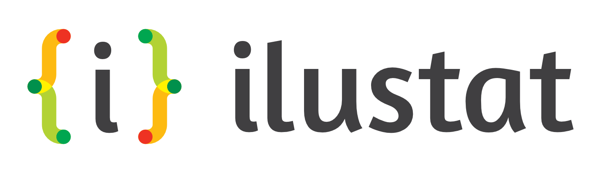
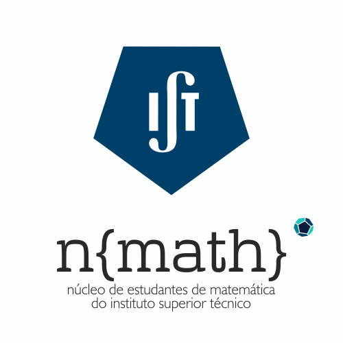

```{r packages, echo = FALSE, message=FALSE, eval = FALSE}
install.packages("devtools")
# Turn eval = TRUE, if you don't have 'devtools' installed
```


```{r install slidify, echo = FALSE, message=FALSE, eval = FALSE}
library(devtools)
install_github('ramnathv/slidify')
install_github('ramnathv/slidifyLibraries')
library(slidify)
```

## Apresentação da comunidade R-Ladies 

### *"A World-Wide organization to promote gender diversity in the R community"*

```{r global map, out.width = "600px", echo = FALSE}
knitr::include_graphics("assets/img/RLadiesGlobal_LeafletMap.png")
```

4000 R-Ladies e 30 cidades iniciaram um grupo R-Ladies

---
  
## Público-alvo:

* Para quem nunca programou
* Para quem nunca programou em R
* Para quem já conhece o R mas precisa de saber conceitos básicos

---

## Objetivos da sessão:

No final da sessão deverão ser capazes de: 

*	Identificar e classificar dados
*	Construir bases de dados
*	Perceber funções simples e a sua dinâmica 
*	Ler dados a partir de ficheiros
*	Utilizar a ajuda do R-Studio

---

## Conteúdos

* Tipos de dados 
* Atribuir valores a variáveis
* Estrutura de dados (vectores, matrizes e Data Frames)
* Funções simples
* Ler dados a partir de ficheiros

--- &vcenter

**Programar não é uma atividade a solo. Devemos fazer perguntas e cooperar. Todos passamos pelas mesmas dificuldades.**

---

### Podemos usar o R como uma calculadora

```{r}
2 + 2
2 * 6 + 9 * (10 ^ (-3) + 6 * 2)
```


### **Exercício 1**

Experimentar um cálculo à escolha.

--- 

```{r child = 'Sections/SimpleDataTypes.Rmd'}
```

---

```{r child = 'Sections/VariableAssignment.Rmd'}
```

---

```{r child = 'Sections/DataStructures.Rmd'}
```

---

```{r child = 'Sections/Vectors.Rmd'}
```

---

```{r child = 'Sections/Matrixes.Rmd'}
```

---

```{r child = 'Sections/DataFrames.Rmd'}
```

---

```{r child = 'Sections/MissingValues.Rmd'}
```

---

```{r child = 'Sections/Functions.Rmd'}
```

---

```{r child = 'Sections/ReadingWritingData.Rmd'}
```

---

## Let's swirl:
```{r, eval = FALSE}
if("swirl" %in% installed.packages() == FALSE){install.packages("swirl")} 
library(swirl)
install_from_swirl("R_Programming")
swirl()
# continue writing on the console
```

---
## Referências

* [Cheat sheet]("https://www.rstudio.com/wp-content/uploads/2016/05/base-r.pdf")
* https://www.coursera.org/learn/r-programming/lecture/pAbaE/overview-and-history-of-r
* https://github.com/rladies/meetup-presentations_london/blob/master/2016-10_Beginner_Dropin/slides.Rmd
* https://ase.tufts.edu/bugs/guide/assets/R%20Cookbook.pdf


--- &vcenter
## Onde nos podem encontrar 

www.meetup.com/R-Ladies-Lisboa

https://github.com/rladieslx

www.twitter.com/RLadiesLx/ | www.facebook.com/groups/RLadiesLisboa

https://twitter.com/RLadiesGlobal | https://rladies.org

---
## Eventos futuros

* 22/04/2017: R, Machine Learning & Microsoft Azure
* 20/05/2017: R-Packages: Tidyverse, Dplyr


--- &vcenter 
## Agradecimentos

```{r r-ladies logo, out.width= '200px', echo = FALSE}
knitr::include_graphics("assets/img/R-LadiesGlobal_logo.png")
```


```{r ilustat logo, out.width = "200px", echo = FALSE}

```

```{r ideia logo, out.width = "200px", echo = FALSE}

```


--- &vcenter 
## Contactos

lisboa@rladies.org

